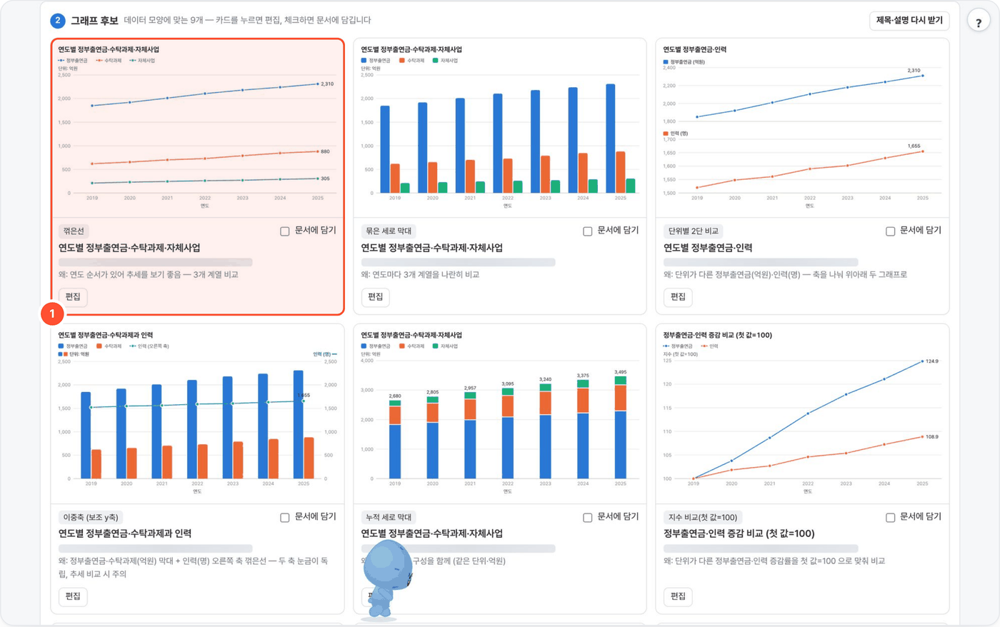
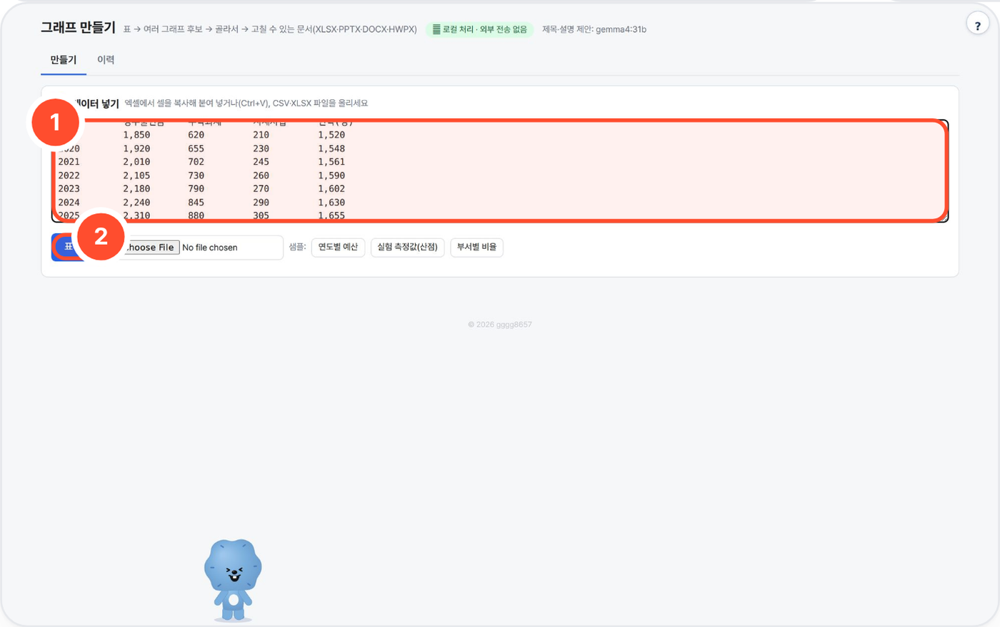
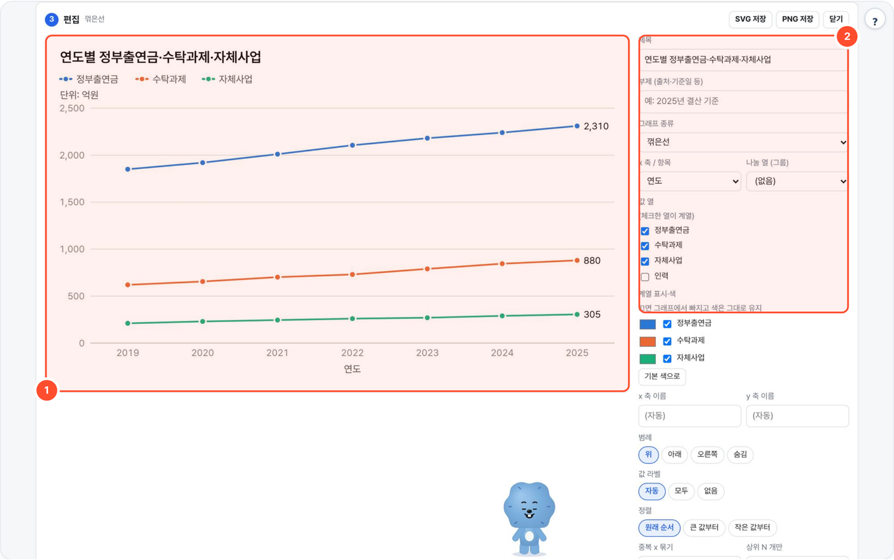

# chart-local — 표 → 그래프 후보 갤러리 → 고칠 수 있는 문서(XLSX·PPTX·DOCX·HWPX)

엑셀에서 복사한 표(또는 CSV·XLSX)를 넣으면 데이터 모양에 맞는 그래프 후보 6~12개를 한꺼번에 그려 보여 주고, 고른 그래프를 **받는 사람이 그 프로그램에서 값을 고칠 수 있는 차트 개체**로 엑셀·파워포인트·워드·한글 문서에 담아 줍니다.



## 무엇을 하나

- 붙여넣기·CSV·XLSX를 파싱해 열 타입(연도·숫자·범주)과 단위를 추론하고, **규칙 엔진**이 어울리지 않는 차트는 빼고 후보를 만듭니다.
- 고른 차트를 편집(제목·축·색·범례·값 라벨·정렬·계열 on/off)한 뒤 XLSX·PPTX·DOCX·HWPX의 네이티브 차트 XML로 내보냅니다.
- 차트 숫자는 표에서만 읽습니다. 로컬 LLM은 후보마다 제목·한 줄 설명 문구만 붙이고, 표에 없는 숫자가 섞인 문장은 버립니다. LLM이 없어도 규칙 기반 제목으로 동작합니다.
- SVG 렌더러를 자체 구현해 CDN·외부 통신이 없습니다.

## 사용 방법



1. **표 데이터를 넣는다** — ① 칸에 엑셀 표(머리글 포함)를 붙여 넣거나 CSV·XLSX를 올리고 ② **표 읽기**. 처음이면 **샘플**(연도별 예산·실험 측정값·부서별 비율) 버튼을 누르세요.
2. **파싱 후 추천을 본다** — 읽힌 표의 열 이름·타입·단위를 확인·수정하면, 데이터 모양에 맞는 후보 카드가 나옵니다(맨 위 화면 ①). 카드마다 '왜 이 그래프인지' 한 줄이 붙습니다.
3. **카드를 고르고 편집한다** — 카드를 누르면 편집 탭으로 이동합니다.

   

   ① 큰 미리보기에서 차트 유형·시리즈를 확인하고, ② 편집 패널에서 제목·범례·색·축 범위를 조정합니다. SVG/PNG로 바로 저장할 수도 있습니다.
4. **Office 문서로 저장한다** — 담을 카드의 **문서에 담기**를 체크(여러 개 가능)하고 엑셀 / 파워포인트 / 워드 / 한글 중 하나로 내려받습니다. 결과에는 그림마다 들어간 방식(네이티브 차트 / 색 칠한 표 / 그림+표)과 파일 구조 검사 결과가 표시됩니다.

## 예시

실제로 실행한 입력과 결과입니다(가상 데이터, 제목·설명 제안 gemma4:31b).

- **입력**(붙여넣기 일부):

  ```
  연도별 연구개발 예산 (단위: 억원)
  연도	정부출연금	수탁과제	자체사업	인력(명)
  2019	1850	620	210	1520
  …
  2025	2310	880	305	1655
  ```
- **파싱**: 표 7행 × 5열, 차트 제목 «연도별 연구개발 예산».
- **추천**: 후보 9개 — 꺾은선, 묶은 세로 막대, 단위별 2단 비교(억원·명), 이중축(보조 y축), 누적 세로 막대, 지수 비교(첫 값=100) 등(위 갤러리 화면).

## 설치·실행

```bash
bash setup.sh                 # Python → openpyxl·python-pptx·python-docx(없으면 venv) → kordoc 탐색(HWPX) → LLM 탐색(선택) → selftest → http://localhost:8786
bash setup.sh stop
python3 app.py                # 수동 실행
python3 app.py --cli 표.csv pptx 결과.pptx     # 추천 상위 4개를 문서로 (xlsx|pptx|docx|hwpx)
python3 selftest.py           # LLM 없이 검증 (WORKSPACE 를 임시 폴더로 바꿔 돌고 지움). SELFTEST_OUT=폴더 → SVG·문서 저장
```

| 환경변수 | 기본 | 설명 |
|---|---|---|
| `PORT` | `8786` | 0.0.0.0 에 띄움 |
| `WORKSPACE` | `./_workspace` | 이력 `history/<id>/rec.json` + 내보낸 파일 |
| `LLM_API` / `LLM_BASE_URL` / `LLM_MODEL` | `ollama` / `http://localhost:11434` / `qwen3:8b` | 후보 제목·설명 제안에만 씀. 없으면 규칙 기반 제목 그대로. 포털로 띄우면 로컬 Ollama `gemma4:31b` |
| `LLM_API_KEY` | (없음) | OpenAI 호환 서버 키 |
| `NUM_CTX` | `8192` | Ollama 컨텍스트 |
| `KORDOC_CLI` | `../kordoc-local/node_modules/kordoc/dist/cli.js` | HWPX 생성기. 없으면 HWPX 만 꺼짐 |

## 구성
- `core.py` — 붙여넣기(탭)·CSV(cp949 포함)·XLSX(시트 선택) 읽기, 제목 줄·`(단위: 억원)` 줄·머리글·머리글 아래 단위 행·`예산(억원)` 처리,
  천단위 쉼표·`%`·괄호 음수·`△` 음수, 열 타입(숫자·날짜/기간·범주) 추론, 기간이 가로 머리글인 표 자동 전치, 긴 형식(연도·부서·값) 자동 피벗,
  **추천 규칙**, 차트용 데이터 준비(중복 x 합계/평균, 정렬, 상위 N)
- `svg.py` — 그래프 15종 SVG 렌더러(미리보기·PNG·HWPX 그림 공통)
- `export.py` — 4개 형식 생성 + `verify()`(만든 파일을 다시 열어 구조 검사)
- `app.py` — stdlib HTTP, LLM 호출·숫자 거르기, 이력 · `ui.html` — 화면

## 추천 규칙 (부적합한 차트는 만들지 않음)
| 데이터 모양 | 후보 |
|---|---|
| 날짜·기간 열 + 숫자 열 | 꺾은선, 세로 막대, 묶은 막대(계열 2~4·항목 ≤12), 누적 막대·누적 영역(같은 단위·음수 없음), 영역(계열 1) |
| 단위가 다른 숫자 열 | **이중축**(왼쪽 축 1~2 계열 막대 + 오른쪽 축 1 계열 꺾은선, 선택으로 선+선), **단위별 2단 비교**(같은 x 축 위·아래 두 그래프), 지수 비교(첫 값=100) |
| 같은 단위·자릿수 차이 20배 이상 | 이중축(큰 계열 막대 + 작은 계열 오른쪽 축 선), 지수 비교 |
| 범주 열 + 숫자 열 | 가로 막대(크기순, ≤30개), 세로 막대(≤12개), 묶은/누적/100% 누적 막대 |
| 범주 2~6개 · 모두 양수 | 원그래프·도넛 (범주 7개 이상·음수 있으면 만들지 않음) |
| 긴 형식 (x 반복 + 범주 열) | 그룹별 꺾은선·묶은/누적/100% 막대, 히트맵, 그룹별 상자그림 |
| 숫자 열 2개 이상 · 행 ≥8 | 산점도(상관 강한 쌍 2개, |r|≥0.3 이면 추세선), 그룹 색 산점도(그룹 2~3개) |
| 행 ≥15 | 히스토그램(깔끔한 구간 폭), 행 ≥8 상자그림 |
| 계열 ≥3 × 항목 ≥3 | 히트맵 |

## 내보내기 — 무엇이 '고칠 수 있는' 상태인가
| 형식 | 차트 | 데이터 | 비고 |
|---|---|---|---|
| XLSX | 엑셀 네이티브 차트 (openpyxl) | '데이터' 시트 + 그림 시트의 **수식**(데이터 시트 직접 참조·SUMIFS·COUNTIFS·QUARTILE.INC) | 데이터 시트 값을 고치면 차트가 바뀜. 히트맵은 조건부 서식 색조. 수식이라 처음 열 때 계산(fullCalcOnLoad) |
| PPTX | 파워포인트 네이티브 차트 (python-pptx) | 차트 내장 워크북 → '데이터 편집' | 그림마다 슬라이드 1장 |
| DOCX | 워드 네이티브 차트 | 내장 워크북 → '데이터 편집' + 본문 데이터 표 | python-pptx 로 만든 차트 파트(chartSpace + 내장 xlsx)를 `word/charts/` 로 옮기고 인라인 `c:chart` 로 참조 |
| HWPX | 한글 차트 개체 (kordoc ```chart → `Chart/chartN.xml`) | 한글 표 | 상자그림·히트맵·이중축은 kordoc 한글 차트가 지원하지 않아 PNG + 표(kordoc 차트 생성기는 한 차트에 플롯 1종·값 축 1개만 만듦). 산점도는 첫 계열만 차트(나머지는 표), 추세선은 한글에서 추가 |

이중축: 축 제목을 축마다 계열 색, 범례에 '(오른쪽 축)', 카드 설명에 '두 축 눈금이 독립 — 추세 비교 시 주의'. 기본은 두 축 모두 0부터, 0 위·아래 눈금 칸 수를 맞춰 격자를 공유하고, 음수가 있으면 두 축 범위를 고정해 0선을 맞춤(편집에서 '오른쪽 축은 데이터 범위'로 풀 수 있음).
- XLSX: openpyxl `BarChart + LineChart`, 오른쪽 `y_axis.axId=200, crosses="max"`. 데이터는 다른 그림처럼 데이터 시트 참조 수식
- PPTX·DOCX: python-pptx 에 콤보·보조축 API 가 없어 차트 XML 을 직접 고침 — 오른쪽 축 계열을 새 `c:lineChart` 로 옮기고 숨긴 `c:catAx` + 오른쪽 `c:valAx(crosses=max)` 추가. 내장 워크북은 그대로라 '데이터 편집'으로 두 계열 모두 고칠 수 있음. `verify` 가 플롯 2종·값 축 2개를 다시 읽어 확인

히트맵은 PPTX·DOCX 에서 색 칠한 표(편집 가능, 차트 개체 아님). 상자그림 문서 차트는 누적 막대 + 오차 막대(수염=최소~최대).

### 검증 방법 (`export.verify`, selftest 에서 4형식 × 샘플 4종)
- PPTX·DOCX: zip 무결성, `[Content_Types]` 등록, 차트 XML 을 python-pptx 차트 객체로 다시 읽어 계열·값 확인, `c:externalData` → 내장 xlsx 관계 추적 후 openpyxl 로 열어 값이 차트 캐시와 같은지, DOCX 본문 `c:chart` 참조 수 = 차트 파트 수
- XLSX: 차트 XML 의 모든 범위 참조가 존재하는 시트를 가리키는지, 수식이 가리키는 데이터 셀이 비어 있지 않은지
- HWPX: `content.hpf` 매니페스트·본문 `chartIDRef` 일치, chartSpace 계열·캐시 점, `kordoc validate`
- 한계: 이 서버에 MS Office·한글·LibreOffice 가 없어 **실제 프로그램으로 열어 렌더링한 확인은 하지 않았습니다** — 구조 검사만.

폐쇄망: 폴더를 통째로 복사. 인터넷 되는 PC 에서 `pip download -r requirements.txt -d wheels` 로 받은 휠을 `wheels/` 에 넣으면 오프라인 설치.
HWPX 는 같은 서버의 kordoc-local(Node + kordoc) 을 씁니다.

## 출처·감사 (Credits)

- [openpyxl](https://foss.heptapod.net/openpyxl/openpyxl) (MIT), [python-pptx](https://github.com/scanny/python-pptx) (MIT), [python-docx](https://github.com/python-openxml/python-docx) (MIT), lxml (BSD-3), XlsxWriter (BSD-2), Pillow (HPND)
- 선택: [kordoc](https://github.com/chrisryugj/kordoc) (MIT, chrisryugj) — HWPX 차트 생성, rsvg-convert (librsvg, LGPL)
- SVG 렌더러는 이 패키지에서 새로 작성(외부 차트 라이브러리 없음). 샘플 데이터는 가상의 값입니다.
- **LLM 실행** — OpenAI 호환 API 로 호출합니다(모델 가중치는 동봉하지 않음). 기본 배포는 [Ollama](https://github.com/ollama/ollama) (MIT) 위의 Google [Gemma](https://ai.google.dev/gemma) `gemma4:31b` — 모델 이용 조건은 Gemma 배포처 참고.
- 이 도구는 [agent-page-portal](https://github.com/gggg8657/agent-page-portal) 에 연결해 쓰도록 만들었습니다(단독 실행도 됨).

저작권 표기·전체 목록은 `NOTICE` 를 보세요.

## 라이선스

MIT License — Copyright (c) 2026 gggg8657 (DongJu Kim). `LICENSE` 참고.
